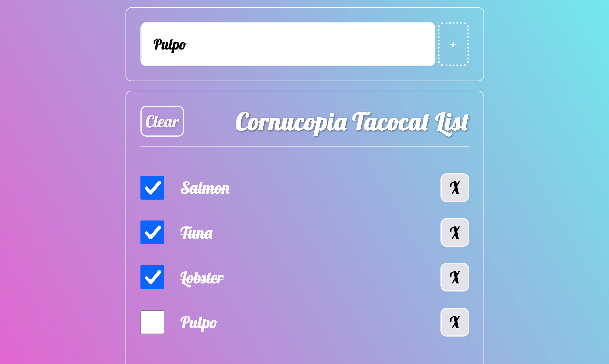

# Cornucopia Tacocat List


Client-side task list application built with Vite, TypeScript, and vanilla JavaScript. The project demonstrates a modular architecture using the Singleton pattern for state management and DOM rendering, with no external dependencies beyond the development toolchain.

## Overview

This application enables users to:
- Add new tasks via a form input.
- Persist tasks in `localStorage` across browser sessions.
- Clear all tasks with a dedicated button.
- Render the task list dynamically using a template-based approach.

The implementation follows object-oriented principles with clear separation of concerns:
- **Model**: `FullList` (Singleton) manages the collection of tasks and persistence.
- **Model**: `ListItem` represents individual tasks with an ID and description.
- **View**: `ListTemplate` (Singleton) handles DOM rendering and clearing.

## App



## Features
- **Task Addition**: Submitting the form creates a new `ListItem` with an auto-incremented ID.
- **Persistence**: Tasks are saved to `localStorage` on addition and loaded on page initialization.
- **Clear Functionality**: One-click removal of all tasks with UI update.
- **Type Safety**: Full TypeScript support ensures robust typing for DOM elements and data.

## Setup and Installation

### Prerequisites
Ensure the following are installed:

- [Node.js](https://nodejs.org/) (v18 or later recommended)
- [npm](https://www.npmjs.com/) or [pnpm](https://pnpm.io/) / [yarn](https://yarnpkg.com/)

### Installation

1. Clone the repository:
   ```bash
   git clone https://github.com/tpreisig/tacocat-list.git
   cd tasks
   ```
2. Install dependencies
   ```bash
   npm install
   ```

## Scripts

The `package.json` defines the following scripts:

| **Script** | **Description**
| :--- | :---
| `dev` | Starts the Vite development server with hot reload.
| `build` | Compiles TypeScript and build production assets.
| `preview`| Serves the production build locally for testing.

## Project Structure

```
vite-task-list/
├── public/                  # Static assets served as-is
├── src/                     # Source code directory
│   ├── css/
│   │   └── style.css        # Application stylesheet
│   ├── model/
│   │   ├── FullList.ts      # Singleton class for task list management
│   │   └── ListItem.ts      # Model for individual task items
│   ├── templates/
│   │   └── ListTemplate.ts  # Singleton for UI rendering
│   └── main.ts              # Application entry point and initialization
├── index.html               # Main HTML template
├── package.json             # Project metadata and scripts
├── tsconfig.json            # TypeScript configuration
├── vite.config.ts           # Vite build configuration
└── README.md                # Project documentation

```

## License

This project is private and intended for demonstration or personal use. See package.json for details.

## Contact

Maintained by tpreisig - feel free to reach out!
