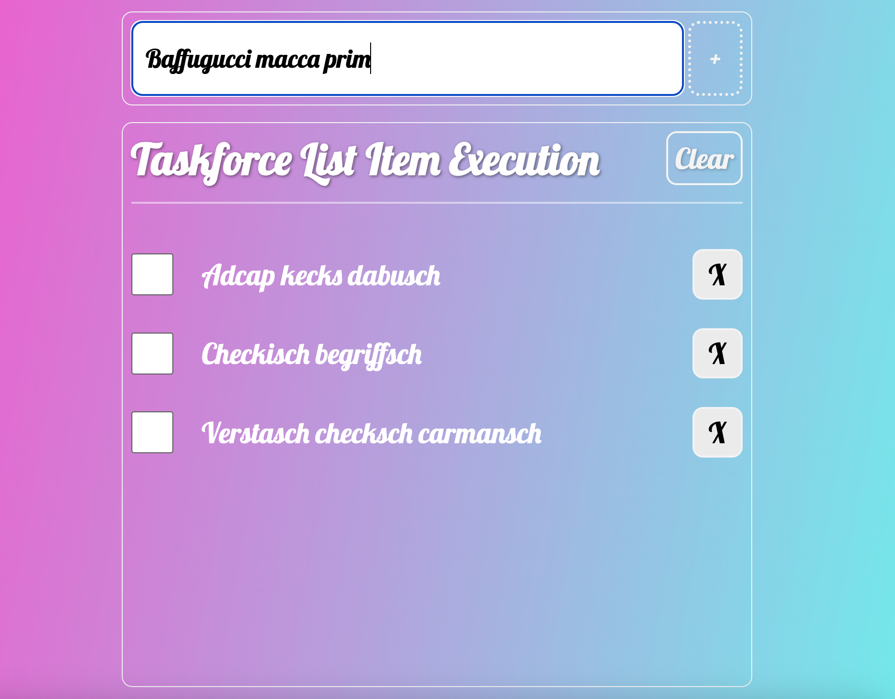

# Taskforce List Item Execution

Fully functional and responsive task list built and written with TypeScript and Vite. The task list helps you track of the important and urgent things you need to do. You can easily add new tasks, mark them as completed or delete them when they are no longer needed.


## Installation

1. Clone the repository:
   ```bash
   git clone https://github.com/tpreisig/vite-task-list.git
   ```
2. Navigate to the project directory:
   ```bash
   cd vite-task-list
   ```
3. Install dependencies:
   ```bash
   npm install
   ```
## License

This project is licensed under the MIT License - see the [LICENSE](LICENSE) file for details.


## Screenshots



## Contact

Maintained by tpreisig - feel free to reach out!
